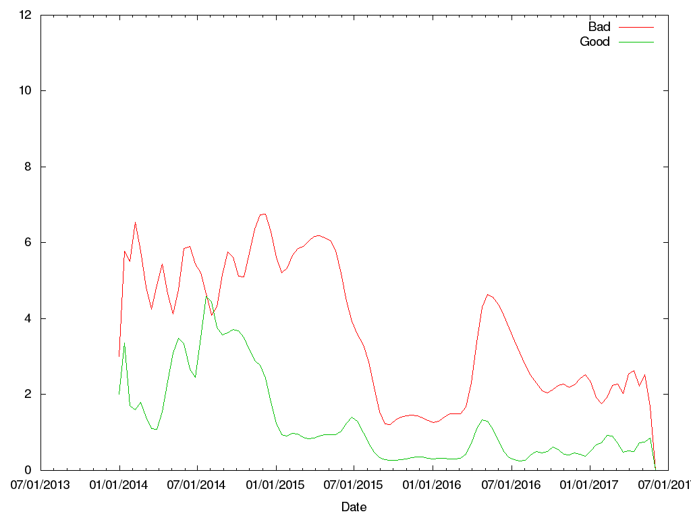

# world_news_meter
A quick tool to track the trend world emotion.

## Metrics ##
Three times a day this code will check CNN's RSS feed for a set of "bad" and "good" words, recording them for future use. A GnuPlot chart is then generated showing the results over time:

* bad = [ flu | death | kill | war| rape| murder ]
* good = [ art | love | peace | fun]

